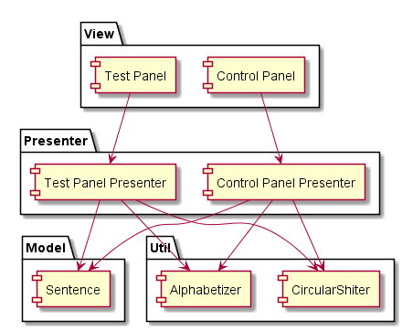
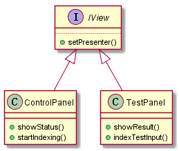
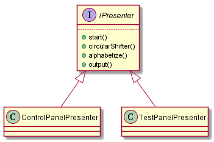
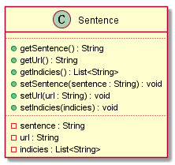

# Architecture Specification 

# 1. Introduction
## 1.1 Purpose of the system
## 1.2 Design Goal
## 1.3 Definition, Acronyms and Abbreviation
## 1.4 References
## 1.5 Overview
# 2  Current System Architecture
## 2.1 Various architecture style
## 2.2 Current system Architecture
# 3  Proposed Software Architecture
## 3.1 Overview

The system architecture design takes consideration from six different aspects, namely, subsystem decomposition , hardware and software mapping, persistent data management, access control and security, global software control, and boundary condition.

The subsystem decomposition gives an insight on the internal mechanism of the system, elaborates how the task is divided to subtasks and delivered to different components, and explains the considerations of the design of each component.

Hardware/software mapping lists the necessary hardware and software requirements in order to run the system, and how do they work with the system.

Persistent data management describes what type of technologies we uses for storing data and tolerating failures.

Access control and security introduces what authentication methods are used in the system and what methods are employed in order to keep the data secure.

Global software control explains how the subsystems/components work together, and what is the dataflow like during the transactions.

Boundary condition lists the data interfaces between subsystems/components. This is basically the agreements that needs to compiled by every subsystems to make the entire system work. 

## 3.2 Subsystem decomposition

Abstract data type (ADT) is chosen as the architect for our system after evaluated functional and non-functional requirements from different aspects of the four types of architect. Among the ADT architect, we particularly employ model view presenter (MVP). 

### 3.2.1 View

Though the KWIC index system is simple, based on our targeting users, we need two different user interfaces to coordinate production and development needs. Thus, we have control panel which is the production UI for real user, and test panel for tester.

### 3.2.2 Presenter

The presenter underlays the data operations and process the sentences sequentially. When sentences are gathered from tester input or collected data, the presenter first pass them to CircularShifter to permutate the sentences in different order word by word, and then the results are passed to Alphabetizer to order the sentences. 

### 3.2.3 Model

Due to the simplicity nature of the KWIC index system, the only model that is needed for the system is the Sentence model. The model is also used to store the necessary info of the data source, such as: original sentence, source url, and its indicies.

## 3.3 Hardware/Software Mapping
## 3.4 Persistent Data Management
## 3.5 Access control and Security
## 3.6 Global software control
## 3.7 Boundary condition
# 4  Sub system Services Glossary
