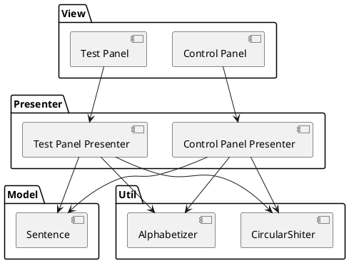
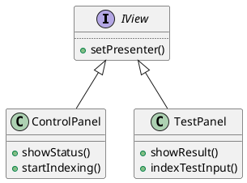
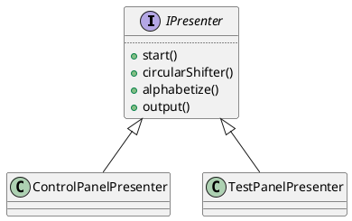
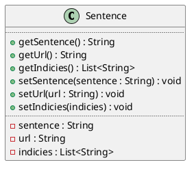

```plantuml
@startuml

package "View" {
    [Control Panel]
    [Test Panel]
}

package "Presenter" {
    [Control Panel Presenter]
    [Test Panel Presenter]
}

package "Model" {
    [Sentence]
}

package "Util" {
    [CircularShiter]
    [Alphabetizer]
}

[Control Panel] --> [Control Panel Presenter]
[Test Panel] --> [Test Panel Presenter]
[Control Panel Presenter] --> [Sentence]
[Test Panel Presenter] --> [Sentence]
[Control Panel Presenter] --> [CircularShiter]
[Test Panel Presenter] --> [CircularShiter]
[Control Panel Presenter] --> [Alphabetizer]
[Test Panel Presenter] --> [Alphabetizer]

@enduml
```

```plantuml
@startuml

IView <|-- ControlPanel
IView <|-- TestPanel

interface IView {
    ....
    + setPresenter()
}

class ControlPanel {
    + showStatus()
    + startIndexing()
}

class TestPanel {
    + showResult()
    + indexTestInput()
}

@enduml
```

```plantuml
@startuml

IPresenter <|-- ControlPanelPresenter
IPresenter <|-- TestPanelPresenter

interface IPresenter {
    ....
    + start()
    + circularShifter()
    + alphabetize()
    + output()
}

class ControlPanelPresenter {
}

class TestPanelPresenter {
}

@enduml
```

```plantuml
@startuml

class Sentence {
    ....
    + getSentence() : String
    + getUrl() : String
    + getIndicies() : List<String>
    + setSentence(sentence : String) : void
    + setUrl(url : String) : void
    + setIndicies(indicies) : void
    ....
    - sentence : String
    - url : String
    - indicies : List<String>
}

@enduml
```