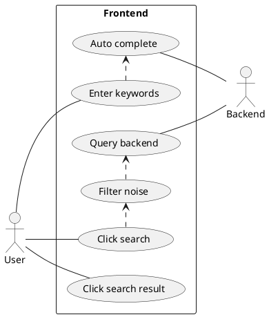
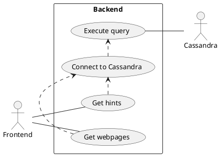
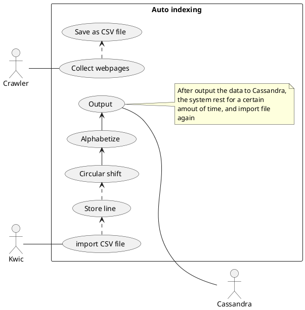

|   |   |
|---|---|
|Use Case name   |Frontend workflow   |
|Participating Actors   |User, Frontend, Backend   |
|Entry condition   |User enters a keyword and press search button or user is typing   |
|Flow of events   |<ul><li>The system accepts the input</li><li>Filter noise words</li><li>Send the query to backend API</li><li>Backend returns result</li><li>The system displays the results</li></ul>   |
|Exit condition   |The results are displayed   |
|Exceptions   |<ul><li>Any error happends during the process</li><li>Network issues</li>  |
|Special Requirements   |None   |

|   |   |
|---|---|
|Use Case name   |Backend workflow   |
|Participating Actors   |Frontend, Backend, Cassandra   |
|Entry condition   |Backend receives a query request from frontend   |
|Flow of events   |<ul><li>Backend recevies queries from frontend</li><li>Backend connects to Cassadra</li><li>Execute query to cassandra</li><li>return results</li></ul>   |
|Exit condition   |Query results are being returned to frontend   |
|Exceptions   |<ul><li>Any error happends during the process</li><li>Network issues</li>  |
|Special Requirements   |None   |

|   |   |
|---|---|
|Use Case name   |Auto-indexing   |
|Participating Actors   |Crawler, KWIC, Cassandra   |
|Entry condition   |By script, running at midnight   |
|Flow of events   |<ul><li>Crawler collects data from Internet</li><li>Saves data to CSV file</li><li>KWIC imports CSV files</li><li>Produce indices</li><li>Saves to Cassandra</li></ul>   |
|Exit condition   |All the CSV file of the day is processed   |
|Exceptions   |<ul><li>Any error happends during the process</li><li>File I/O exceptions</li><li>Network issues</li>  |
|Special Requirements   |None   |