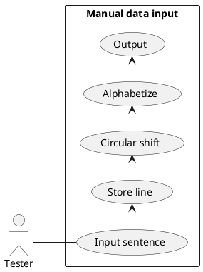
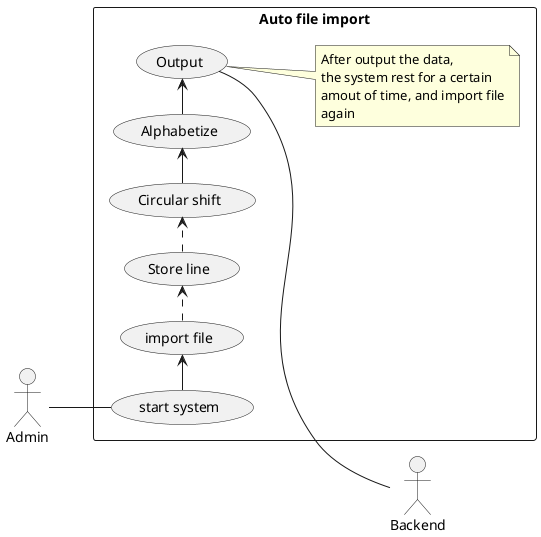
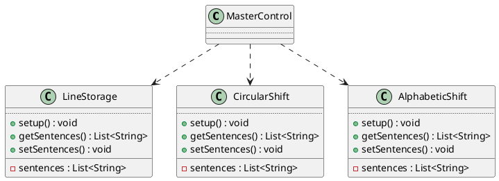
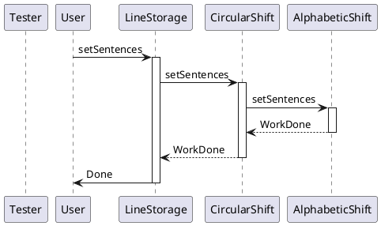
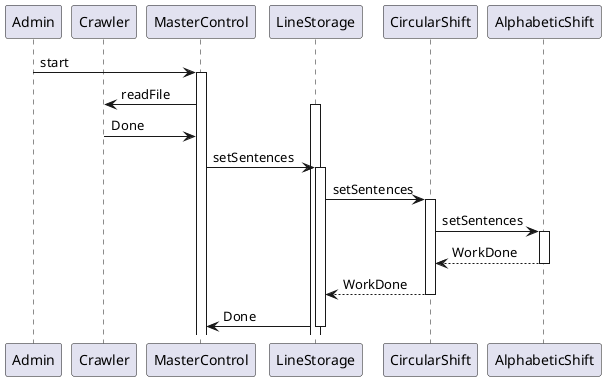

```plantuml
@startuml
left to right direction
skinparam packageStyle rectangle
actor Tester
rectangle "Manual data input" {
  Tester -- (Input sentence)
  (Input sentence) .> (Store line)
  (Store line) .> (Circular shift)
  (Circular shift) -> (Alphabetize)
  (Alphabetize) -> (Output)
}
@enduml
```

```plantuml
@startuml
left to right direction
skinparam packageStyle rectangle
actor Admin
actor Backend
rectangle "Auto file import" {
  Admin -- (start system)
  (start system) -> (import file)
  (import file) .> (Store line)
  (Store line) .> (Circular shift)
  (Circular shift) -> (Alphabetize)
  (Alphabetize) -> (Output)
  (Output) -- Backend
  note right of (Output)
    After output the data,
    the system rest for a certain
    amout of time, and import file
    again
  end note
}
@enduml
```

```plantuml
@startuml
MasterControl ..> LineStorage
MasterControl ..> CircularShift
MasterControl ..> AlphabeticShift

class LineStorage {
  ....
  + setup() : void
  + getSentences() : List<String>
  + setSentences() : void
  ____
  - sentences : List<String> 
}

class CircularShift {
  ....
  + setup() : void
  + getSentences() : List<String>
  + setSentences() : void
  ____
  - sentences : List<String> 
}

class AlphabeticShift {
  ....
  + setup() : void
  + getSentences() : List<String>
  + setSentences() : void
  ____
  - sentences : List<String> 
}

class MasterControl {
  ....
  ____
}

@enduml
```

```plantuml
@startuml
participant Tester

User -> LineStorage: setSentences
activate LineStorage

LineStorage -> CircularShift: setSentences
activate CircularShift

CircularShift -> AlphabeticShift: setSentences
activate AlphabeticShift
AlphabeticShift --> CircularShift: WorkDone
deactivate AlphabeticShift

CircularShift --> LineStorage: WorkDone
deactivate CircularShift

LineStorage -> User: Done
deactivate LineStorage

@enduml
```

```plantuml
@startuml
participant Admin
participant Crawler

Admin -> MasterControl: start
activate MasterControl

MasterControl -> Crawler: readFile
activate LineStorage

Crawler -> MasterControl: Done
deactivate Crawler

MasterControl -> LineStorage: setSentences
activate LineStorage

LineStorage -> CircularShift: setSentences
activate CircularShift

CircularShift -> AlphabeticShift: setSentences
activate AlphabeticShift
AlphabeticShift --> CircularShift: WorkDone
deactivate AlphabeticShift

CircularShift --> LineStorage: WorkDone
deactivate CircularShift

LineStorage -> MasterControl: Done
deactivate LineStorage

@enduml
```