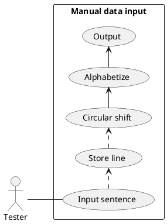
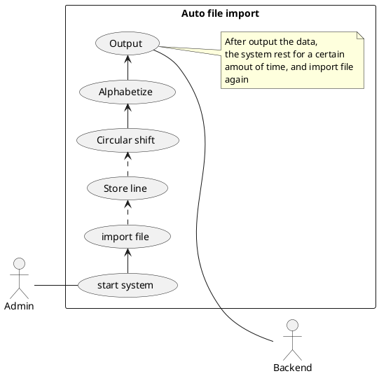
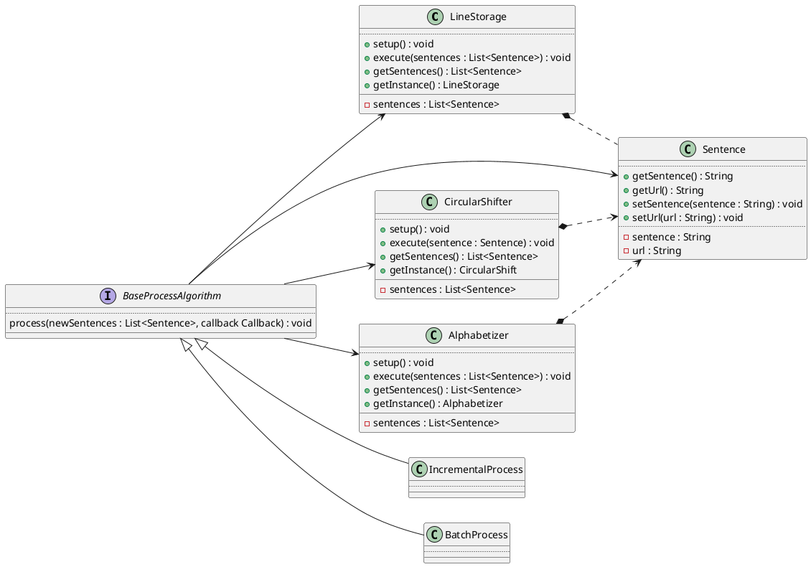
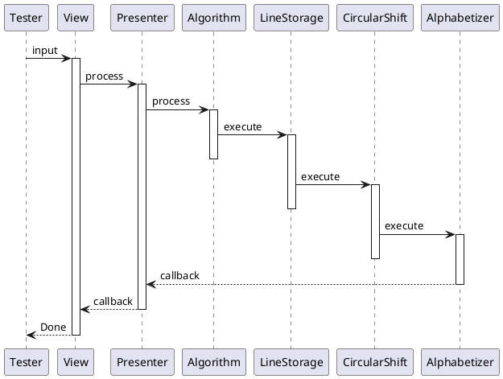
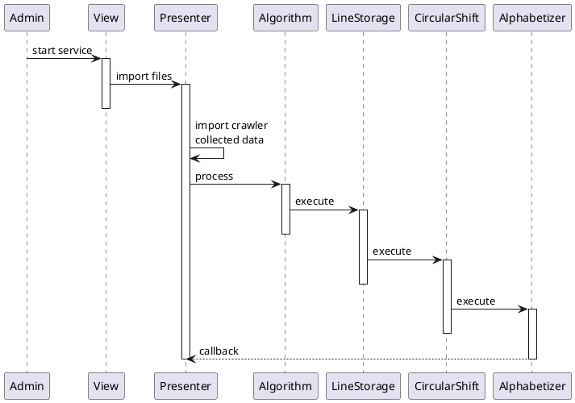

```plantuml
@startuml
left to right direction
skinparam packageStyle rectangle
actor Tester
rectangle "Manual data input" {
  Tester -- (Input sentence)
  (Input sentence) .> (Store line)
  (Store line) .> (Circular shift)
  (Circular shift) -> (Alphabetize)
  (Alphabetize) -> (Output)
}
@enduml
```

```plantuml
@startuml
left to right direction
skinparam packageStyle rectangle
actor Admin
actor Backend
rectangle "Auto file import" {
  Admin -- (start system)
  (start system) -> (import file)
  (import file) .> (Store line)
  (Store line) .> (Circular shift)
  (Circular shift) -> (Alphabetize)
  (Alphabetize) -> (Output)
  (Output) -- Backend
  note right of (Output)
    After output the data,
    the system rest for a certain
    amout of time, and import file
    again
  end note
}
@enduml
```

```plantuml
@startuml
left to right direction
LineStorage *.. Sentence
CircularShifter *..> Sentence
Alphabetizer *..> Sentence
BaseProcessAlgorithm --> Sentence
BaseProcessAlgorithm --> LineStorage
BaseProcessAlgorithm --> CircularShifter
BaseProcessAlgorithm --> Alphabetizer
BaseProcessAlgorithm <|-- IncrementalProcess
BaseProcessAlgorithm <|-- BatchProcess

class Sentence {
    ....
    + getSentence() : String
    + getUrl() : String
    + setSentence(sentence : String) : void
    + setUrl(url : String) : void
    ....
    - sentence : String
    - url : String
}

class LineStorage {
  ....
  + setup() : void
  + execute(sentences : List<Sentence>) : void
  + getSentences() : List<Sentence>
  + getInstance() : LineStorage
  ____
  - sentences : List<Sentence> 
}

class CircularShifter {
  ....
  + setup() : void
  + execute(sentence : Sentence) : void
  + getSentences() : List<Sentence>
  + getInstance() : CircularShift
  ____
  - sentences : List<Sentence> 
}

class Alphabetizer {
  ....
  + setup() : void
  + execute(sentences : List<Sentence>) : void
  + getSentences() : List<Sentence>
  + getInstance() : Alphabetizer
  ____
  - sentences : List<Sentence> 
}

interface BaseProcessAlgorithm {
  ....
  process(newSentences : List<Sentence>, callback Callback) : void
  ____
}

class IncrementalProcess {
  ....
  ____
}

class BatchProcess {
  ....
  ____
}

@enduml
```

```plantuml
@startuml
participant Tester

Tester -> View: input
activate View

View -> Presenter: process
activate Presenter

Presenter -> Algorithm: process
activate Algorithm

Algorithm -> LineStorage: execute
activate LineStorage
deactivate Algorithm

LineStorage -> CircularShift: execute
activate CircularShift
deactivate LineStorage

CircularShift -> Alphabetizer: execute
activate Alphabetizer
deactivate CircularShift

Alphabetizer --> Presenter: callback
deactivate Alphabetizer

Presenter --> View: callback
deactivate Presenter

View --> Tester: Done
deactivate View

@enduml
```

```plantuml
@startuml
participant Admin

Admin -> View: start service
activate View

View -> Presenter: import files
activate Presenter
deactivate View

Presenter -> Presenter: import crawler\ncollected data

Presenter -> Algorithm: process
activate Algorithm

Algorithm -> LineStorage: execute
activate LineStorage
deactivate Algorithm

LineStorage -> CircularShift: execute
activate CircularShift
deactivate LineStorage

CircularShift -> Alphabetizer: execute
activate Alphabetizer
deactivate CircularShift

Alphabetizer --> Presenter: callback
deactivate Alphabetizer
deactivate Presenter

@enduml
```