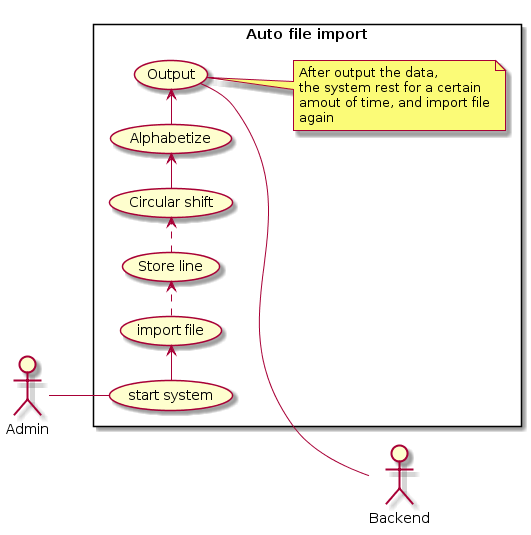
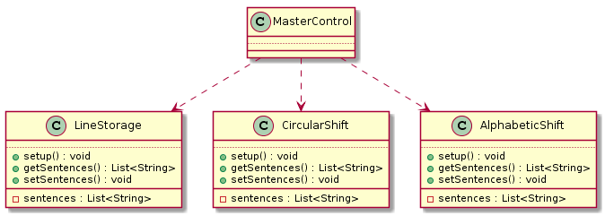
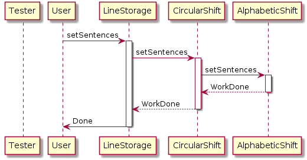
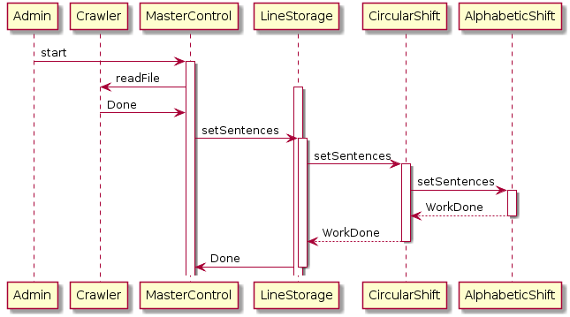

# Requirements Specification

- [Requirements Specification](#requirements-specification)
  - [1. Introduction](#1-introduction)
    - [1.1 Purpose of the system](#11-purpose-of-the-system)
    - [1.2 Scope of the system](#12-scope-of-the-system)
    - [1.3 Objectives and the success criteria of the project](#13-objectives-and-the-success-criteria-of-the-project)
    - [1.4 Definitions, acronyms and abbreviations](#14-definitions-acronyms-and-abbreviations)
    - [1.5 References](#15-references)
    - [1.6 Overview](#16-overview)
  - [2. Current system](#2-current-system)
  - [3. Proposed system](#3-proposed-system)
    - [3.1 Overview](#31-overview)
    - [3.2 Functional requirements](#32-functional-requirements)
      - [3.2.1 Accepting manual input from user](#321-accepting-manual-input-from-user)
      - [3.2.2 Importing data from file](#322-importing-data-from-file)
      - [3.2.3 Periodic data importing](#323-periodic-data-importing)
      - [3.2.4 Output data to backend](#324-output-data-to-backend)
    - [3.3 Nonfunctional requirements](#33-nonfunctional-requirements)
      - [3.3.1 Usability](#331-usability)
      - [3.3.2 Reliability](#332-reliability)
      - [3.3.3 Performance](#333-performance)
      - [3.3.4 Supportability](#334-supportability)
      - [3.3.5 Implementation](#335-implementation)
      - [3.3.6 Interface](#336-interface)
      - [3.3.7 Packaging](#337-packaging)
      - [3.3.8 Legal Requirements](#338-legal-requirements)
    - [3.4 System models](#34-system-models)
      - [3.4.1 Scenarios](#341-scenarios)
      - [3.4.2 Use case model](#342-use-case-model)
        - [3.4.2.1 Manual data input](#3421-manual-data-input)
        - [3.4.2.2 Auto file import](#3422-auto-file-import)
      - [3.4.3 Object model](#343-object-model)
      - [3.4.4 Dynamic model](#344-dynamic-model)
        - [3.4.4.1 Manual data input](#3441-manual-data-input)
        - [3.4.4.2 Auto file import](#3442-auto-file-import)
      - [3.4.5 User interface—navigational paths and screen mock-ups](#345-user-interfacenavigational-paths-and-screen-mock-ups)
  - [4. Glossary](#4-glossary)

## 1. Introduction

This document describes the requirements specification for the KWIC (Key Word in Context) index system. The content of this document includes functional requirements, non-functional requirements of the system, as well as the system models which illustrate the scenarios and the use case model of the KWIC index system. The system models are included in the Requirements Analysis document.

### 1.1 Purpose of the system

Search engine nowadays is widely used by people for researching purposes. The responsiveness and accuracy has became a big concern for web based search engine. Many factors contribute to bad response time and poor keyword targeting rate. First, network oftentimes is the major issue that slows down search engine. Among the many of network issues, excluding internet connectivity, availability is the primary factor that causes slow network response rate. Second, insufficient data records. Search engine is based on the knowledge of the system. The more the system knows, the more it could supply to users. Third, as mentioned before, poorly targeted key words causes the issue that even the system has the knowledge base that user wants to query but the key words do not match to it. This situation is usually caused by user typos or unnecessary words. 

Thus, to address the issues mentioned above, our system is designed to provide features including: high availability, automated learning database, and accurate keyword matching. These features are provided in three subsystems. In this document, we only discuss KWIC subsystem.

### 1.2 Scope of the system

Again, as mentioned before, this system consists of three subsystems, namely, 

1. web crawler system that runs in a background service continuously to collect webpages and their content info,
2. backend API based on a distributed database, Cassandra in specific, 
3. KWIC index system which imports the data collected by web crawler system, generates indices, and outputs them to backend.

In this interim project SRS document, we only discuss the KWIC index system. More details will be described in the final project SRS. From the listed brief introduction, it is obvious that the scope of KWIC index system would be relatively narrow, since it accepts auto generated data from the web crawler system and outputs indices by making a backend API call. However, for testing purpose, the KWIC index system also accepts manual imports from data file, and outputs to a terminal.

### 1.3 Objectives and the success criteria of the project

The ultimate objectives of this project is to provide a search engine that has the features of high availability, knowledgeable database, and accurate keyword matching. Thus, from the overall perspective, the system will be evaluated from three different aspects:

For availability:
1. Does the system still works given one of the remote servers is done
2. Does the system still is still responsive given one of the remote servers is being visited as a hotspot

For knowledgeable database:
1. Does the database increases daily
2. Does the database supplies abundant searching results

For accurate keyword matching:
1. Does the results returned by the system satisfied user need
2. Does the results returned by the system has any irrelevant web pages
3. Does the system filters verbose keywords

However, for the KWIC index system, the criteria would be:
1. Does the system support keywords filtering
2. Does the system returns result when a verbose string is inputted
3. Does the system builds enough indices based on inputted data

### 1.4 Definitions, acronyms and abbreviations

* AM—Access Method
* AM—Active Matrix
* AMOLED—Active-Matrix Organic Light-Emitting Diode
* B2E—Business-to-Employee
* BAL—Basic Assembly Language
* BAM—Block Availability Map
* Bash—Bourne-again shell
* CAT—Computer-Aided Translation
* CAQ—Computer-Aided Quality Assurance
* CASE—Computer-Aided Software Engineering
* cc—C Compiler
* DAO—Data Access Objects
* DAO—Disk-At-Once
* DAP—Directory Access ProtocolEDA—Electronic Design 
* Automation
* EDGE— Enhanced Data rates for GSM Evolution
* EDI—Electronic Data Interchange
* SaaS—Software as a Service
* SAM— Security Account Manager
* SAN—Storage Area Network
* SAS—Serial attached SCSI
* UTRAN—Universal Terrestrial Radio Access Network
* UUCP—Unix to Unix Copy
* VNC—Virtual Network Computing
* VOD—Video On Demand
* VoIP—Voice over Internet Protocol
* VPN—Virtual Private Network
* WPAD—Web Proxy Autodiscovery Protocol
* WPAN—Wireless Personal Area Network
* WPF—Windows Presentation Foundation
* WS-D—Web Services-Discovery
* XMPP—eXtensible Messaging and Presence Protocol
* XMS—Extended Memory Specification
* XNS—Xerox Network Systems
* XP—Cross-Platform
* ZIF—Zero Insertion Force
* ZIFS—Zero Insertion Force Socket
* ZIP—ZIP file archive

### 1.5 References 

* Documenting Software Architectures: Views and Beyond, P. Clements, F. Bachmann, L. Bass, D. Garlan, J. Ivers, R. Little, R. Nord and J. Stafford, MA: Addison-Wesley, 2003.
* Software Architecture in Practice, L. Bass, P. Clements & R. Kazman, Addison Wesley.
* Architecting Software Intensive Systems: A Practitioner’s Guide, A. Lattanze, Boca Raton, FL: Auerbach Publishing, 2008.
* Component-Based Software Engineering, Edited by A. W. Brown, IEEE Computer Society
* Design Patterns: Elements of Reusable Object-Oriented Software, Eric Gamma, Richard Helm, Ralph Johnson and John Vlissides, Addison-Wesley
* Design Patterns for Object-Oriented Software Development, Wolfgang Pree, Addison-Wesley Longman
* Seamless Object-Oriented Software Architecture: Analysis and Design of Reliable Systems, Kim Walden & Jean-Marc Nerson, Prentice Hall
* Designing Enterprise Applications with the J2EE Platform, 2/E, Inderjeet Singh, Beth Stearns, Mark Johnson, The Enterprise Team, Addison Wesley & Benjamin Cummings
* Understanding CORBA: The Common Object Request Broker Architecture, Randy Otte, Paul Patrick and Mark Roy, Prentice Hall
* The Essential Client/Server Architecture: Survivor's Guide, Robert Orfali, Dan Harkey and Jeri Edwards, John Wiley & Sons
* Network Application Support for Building Open Systems, James Martin and Joe Leben, Digital Press
* Non-Functional Requirements in Software Engineering, Lawrence Chung, Brian Nixon, Eric Yu and John Mylopoulos, Kluwer Academic Publishing
* The Unified Modeling Language User Guide, Booch, Rumbaugh, Jacobson, Addison Wesley, 1999

### 1.6 Overview

The system is designed to be object-oriented for better maintainability, thus, uses Abstract Data Type architecture. The interfaces between three subsystems are predefined, so they can be worked together parallelly. More details about the other two subsystems (web crawler system and backend API) is discussed separated. This document elaborates the functional and non-functional requirements for KWIC index system, as well as the system models of it. The KWIC index system is mainly composed of four components:

1. **Line storage**, where the inputted keywords and corresponding URL are stored
2. **Circular shift**, where the keywords are duplicated and shifted in order to improve keywords targeting rate
3. **Alphabetic shift**, where the keywords and its duplications are ordered alphabetically. This provides a B-Tier to enable the auto-completion function in front end.

## 2. Current system

Prior to September 1993 the World Wide Web was entirely indexed by hand. There was a list of webservers edited by Tim Berners-Lee and hosted on the CERN webserver. One Google.nl snapshot of the list in 1992 remains,[4] but as more and more web servers went online the central list could no longer keep up. On the NCSA site, new servers were announced under the title "What's New!"

Web search engine has been evolving ever since. Nowadays, Google occupies 90.14% market share, Bing 3.24%, Baidu 2.18%, and Yahoo! 2.08%, respectively. Search engine becomes very mature, and equiped with state-of-art technologies to make it even more powerful, for example, machine learning enables search engine predicting what user is looking for based on his/her historical search data.

References:
Web search engine: https://en.wikipedia.org/wiki/Web_search_engine

## 3. Proposed system

Our system by no means to develop a search engine that is competitive to these giant companies. The purpose of this project is to let us get familiar with the architecture considerations behind the scene.  

### 3.1 Overview 

Though the aim is not to compete with Google, we still want to implement a completed search engine. Thus the system is designed to have high availability, knowledgeable database, and accurate keyword matching. This document introduces the design of KWIC subsystem in specific, which is responsible for importing collected web page data and indexing them into backend. 

### 3.2 Functional requirements 

This section includes the detailed functional requirements of KWIC index system

#### 3.2.1 Accepting manual input from user

This requirement is mainly for testing purpose. The tester should be able to input a sentence in a textbox manually, and the system should output a list of indices of that sentence.

#### 3.2.2 Importing data from file

The system should be able to read data from files, auto-generates indices according to what has been read, and uploads the data to backend

#### 3.2.3 Periodic data importing

Since the web crawler system collects web page data consistently, the KWIC index system should import what has been collected periodically to allow the crawler system clean out-dated data.

#### 3.2.4 Output data to backend

The system should be able to send generated indices to backend via API call.

### 3.3 Nonfunctional requirements

This section includes the detailed non-functional requirements of KWIC index system

#### 3.3.1 Usability

User-friendly is a big concern nowadays in software industry. Thus, the KWIC system should have a neat and intuitive user interface to guide user have to use this system. Particularly, when the system is formally integrated with web crawler system and backend API, there should have no extra action for the user to take once it has been start.

#### 3.3.2 Reliability

The system should be tested throughly to avoid disaster crush that would impact the whole search engine. Log mechanism should be implemented in order to trace and debug when a crush happened.

#### 3.3.3 Performance

Since the system is used continuously, a background thread should be created for the system. The operating system should not be impacted by the KWIC system because of I/O operations and network trafic.

#### 3.3.4 Supportability

The KWIC system should be supportable in current equipment such as computers, monitors, routers etc.

#### 3.3.5 Implementation

The KWIC system will be implemented parallely with the crawler system and backend API. Each subsystem is designed to be object-oriented style.

#### 3.3.6 Interface

All the data interfaces are defined at the begining of this project. All three subsystems should conform to the agreement to avoid integration issues.

The user interface should be neat and intuitive to guide user have to use this system. Particularly, when the system is formally integrated with web crawler system and backend API, there should have no extra action for the user to take once it has been start.

#### 3.3.7 Packaging

The deliverable of this project should be packed with a readme file including necessary info such as environment setup, usage example, and user manual.

#### 3.3.8 Legal Requirements

The backend and database servers will hosted at ECSS 3.213 University of Texas at Dallas. The usage of this should also be compliant to the university rule. This project is only used for the Advanced Software Architecture course, and should not be used for any commercial purpose without permission.

### 3.4 System models

#### 3.4.1 Scenarios

The KWIC index system only has two possible scenarios due to its nature: manual data input and auto file import. Both scenarios will output indicies. They are described in details in the following use case models.

#### 3.4.2 Use case model

##### 3.4.2.1 Manual data input

This use case is designed for internal test. Thus, the actor would only allow to be tester. The tester should be able to input a sentence and relieved a list of indices as result. 

|                      |                                                                                                                                                                                                                                     |
|:---------------------|:------------------------------------------------------------------------------------------------------------------------------------------------------------------------------------------------------------------------------------|
| Use Case name        | Manual data input                                                                                                                                                                                                                   |
| Participating Actors | Tester                                                                                                                                                                                                                              |
| Entry condition      | Tester inputs a sentence                                                                                                                                                                                                            |
| Flow of events       | <ul><li>Tester inputs a sentence</li><li>Line storage stores the sentence</li><li>Circular shift duplicates and shifts the sentence</li><li>Alphabetize shift re-order the sentences</li><li>Output the ordered sentences</li></ul> |
| Exit condition       | Ordered sentences are outputted                                                                                                                                                                                                     |
| Exceptions           | Any error happends during the process                                                                                                                                                                                               |
| Special Requirements | None                                                                                                                                                                                                                                |

##### 3.4.2.2 Auto file import

This use case is designed for production. After integration with web crawler system and backend API, this system should be able to operate automatically. It reads the collected from crawler system periodically and outputs the indices to database by using backend API. 

|   |   |
|---|---|
|Use Case name   |Auto file import   |
|Participating Actors   |Admin, Backend   |
|Entry condition   |Admin starts system   |
|Flow of events   |<ul><li>System import files periodically</li><li>Line storage stores the imported data</li><li>Circular shift duplicates and shifts the sentences</li><li>Alphabetize shift re-order the sentences</li><li>Output uses Backend to upload the ordered sentences</li></ul>   |
|Exit condition   |Ordered sentences are outputted   |
|Exceptions   |<ul><li>Any error happends during the process</li><li>File I/O exceptions</li><li>Network issues</li>  |
|Special Requirements   |None   |

#### 3.4.3 Object model

#### 3.4.4 Dynamic model

##### 3.4.4.1 Manual data input

##### 3.4.4.2 Auto file import

#### 3.4.5 User interface—navigational paths and screen mock-ups

## 4. Glossary 
